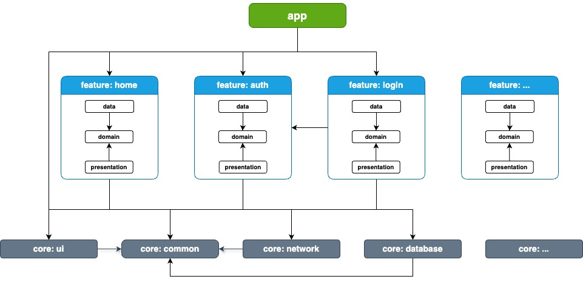

## Types of modules

**Tips**: Use this diagram to plan dependencies between modules.

This project contains the following types of modules:

* `app` module - contains app level initialization such as UI scaffolding, routing, dependency
injections, etc. This is the entry point for running the app that bind the rest of the codebases.
The `app` module depends on all `feature` and `core` modules.

* `feature:...` modules - feature specific modules scoped to handle a single responsibility in the app. 
If a class is needed only by one `feature`, it should remain within that module.
If not, it should be extracted into a shared `feature` or an appropriate `core` module.
The `feature` modules only depend on required `core` or shared `feature` modules.

* `core:...` modules - common library modules containing specific dependencies tha need to be shared
between other modules. A core module can only depend on other core modules. They shouldn't depend on
`feature` or `app` modules.

**Notes**: Please avoid circular dependencies as this project is technically still in monolithic structure
because all modules are only separated by folders that placed in `lib` package. Every dependency flow that
doesn't follow the dependency rules can only be tracked manually from the file imports.